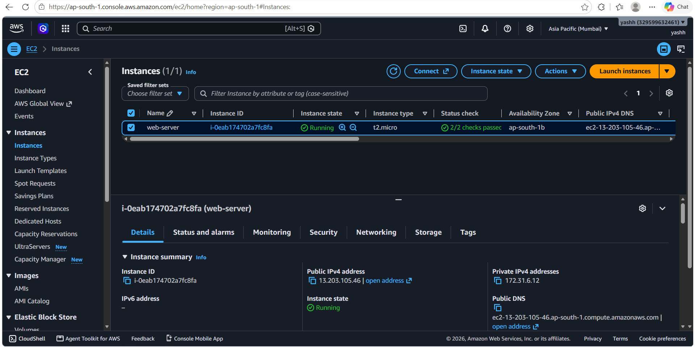
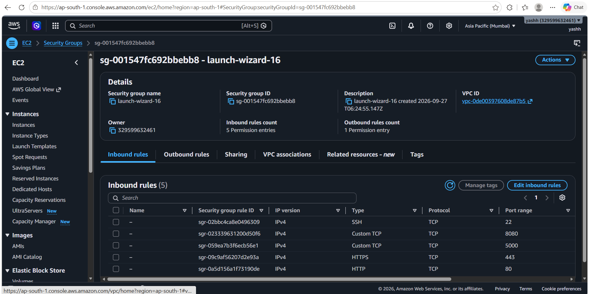
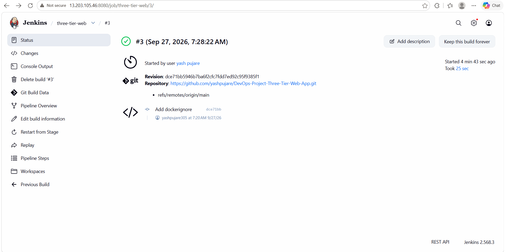
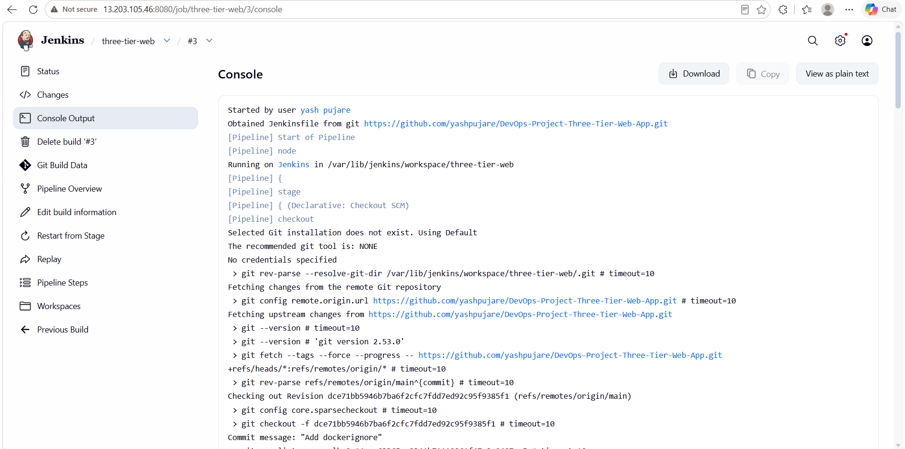
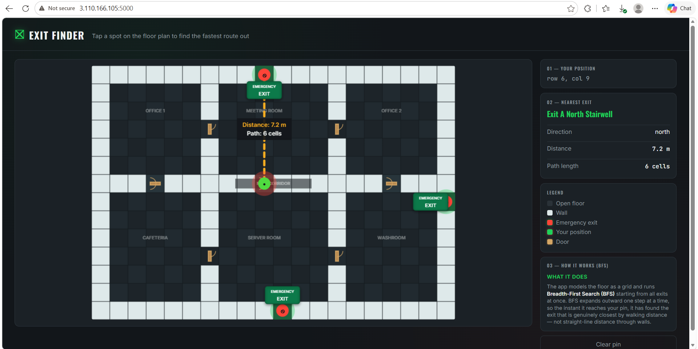

# DevOps Project Report: Automated CI/CD Pipeline for a 3-Tier Flask Application on AWS

**Author:** Yash Pujare  
**Project:** Emergency Exit Finder  
**Platform:** AWS EC2, Docker, Jenkins, GitHub  
**Application:** Flask + MySQL

---

### **Table of Contents**

1. [Project Overview](#1-project-overview)
2. [Architecture Diagram](#2-architecture-diagram)
3. [Step 1: AWS EC2 Instance Preparation](#3-step-1-aws-ec2-instance-preparation)
4. [Step 2: Install Dependencies on EC2](#4-step-2-install-dependencies-on-ec2)
5. [Step 3: Jenkins Installation and Setup](#5-step-3-jenkins-installation-and-setup)
6. [Step 4: GitHub Repository Configuration](#6-step-4-github-repository-configuration)
   - [Dockerfile](#dockerfile)
   - [docker-compose.yml](#docker-composeyml)
   - [Jenkinsfile](#jenkinsfile)
7. [Step 5: Jenkins Pipeline Creation and Execution](#7-step-5-jenkins-pipeline-creation-and-execution)
8. [Conclusion](#8-conclusion)
9. [Infrastructure Diagram](#9-infrastructure-diagram)
10. [Work Flow Diagram](#10-work-flow-diagram)

---

### **1. Project Overview**

This project demonstrates the deployment of an **Emergency Exit Finder** web application on an AWS EC2 instance.

The application is built using **Flask** for the web application layer and **MySQL** for storing emergency-exit and evacuation-log data. Docker and Docker Compose are used to run the application and database as containers.

A Jenkins CI/CD pipeline is connected with the GitHub repository. The pipeline checks out the latest source code, builds the Docker image, and deploys the application using Docker Compose. GitHub webhook integration is used so that a code push can automatically trigger the Jenkins pipeline.

The application models a floor as a grid and uses **Breadth-First Search (BFS)** to find the nearest active emergency exit based on walkable cells.

---

### **2. Architecture Diagram**

```text
+------------------+        +----------------------+        +----------------------+
|    Developer     | -----> |     GitHub Repo      | -----> |    Jenkins Server    |
|  Pushes changes  |        | Source Code +        |        |      on AWS EC2      |
+------------------+        | Jenkinsfile          |        +----------+-----------+
                            +----------------------+                   |
                                                                       |
                                                          1. Checkout Code
                                                          2. Build Docker Image
                                                          3. Run Docker Compose
                                                                       |
                                                                       v
                                                +-------------------------------+
                                                |          AWS EC2               |
                                                |                               |
                                                |  +-------------------------+  |
                                                |  | Flask Application       |  |
                                                |  | Docker Container        |  |
                                                |  | Port 5000               |  |
                                                |  +-----------+-------------+  |
                                                |              |                |
                                                |              v                |
                                                |  +-------------------------+  |
                                                |  | MySQL Database          |  |
                                                |  | Docker Container        |  |
                                                |  +-------------------------+  |
                                                +-------------------------------+
```

---

### **3. Step 1: AWS EC2 Instance Preparation**

1. **Launch EC2 Instance:**
   * Open the AWS EC2 console.
   * Launch the EC2 instance used for the project.
   * The project uses a **t2.micro** instance.
   * The running instance is named **web-server**.



2. **Configure Security Group:**
   * Configure inbound rules for the services used by the project.
   * **SSH:** TCP port `22`
   * **HTTP:** TCP port `80`
   * **HTTPS:** TCP port `443`
   * **Flask application:** TCP port `5000`
   * **Jenkins:** TCP port `8080`



3. **Connect to the EC2 Instance:**

```bash
ssh -i /path/to/key.pem ubuntu@<EC2-PUBLIC-IP>
```

Replace `<EC2-PUBLIC-IP>` with the public IPv4 address of the EC2 instance.

---

### **4. Step 2: Install Dependencies on EC2**

1. **Update packages:**

```bash
sudo apt update && sudo apt upgrade -y
```

2. **Install Git and Docker:**

```bash
sudo apt install git docker.io -y
```

3. **Start and enable Docker:**

```bash
sudo systemctl start docker
sudo systemctl enable docker
```

4. **Allow the current user to run Docker without `sudo`:**

```bash
sudo usermod -aG docker $USER
newgrp docker
```

5. **Verify Docker:**

```bash
docker --version
docker compose version
```

---

### **5. Step 3: Jenkins Installation and Setup**

Jenkins is used to automate the CI/CD process.

1. **Install Java:**

```bash
sudo apt install openjdk-17-jdk -y
```

2. **Install Jenkins:**

```bash
curl -fsSL https://pkg.jenkins.io/debian-stable/jenkins.io-2023.key | \
sudo tee /usr/share/keyrings/jenkins-keyring.asc > /dev/null

echo deb [signed-by=/usr/share/keyrings/jenkins-keyring.asc] \
https://pkg.jenkins.io/debian-stable binary/ | \
sudo tee /etc/apt/sources.list.d/jenkins.list > /dev/null

sudo apt update
sudo apt install jenkins -y
```

3. **Start and enable Jenkins:**

```bash
sudo systemctl start jenkins
sudo systemctl enable jenkins
```

4. **Get the initial Jenkins password:**

```bash
sudo cat /var/lib/jenkins/secrets/initialAdminPassword
```

5. Open Jenkins in the browser:

```text
http://<EC2-PUBLIC-IP>:8080
```

6. **Allow Jenkins to use Docker:**

```bash
sudo usermod -aG docker jenkins
sudo systemctl restart jenkins
```

The Jenkins dashboard is then used to create the pipeline job.

---

### **6. Step 4: GitHub Repository Configuration**

The GitHub repository contains the Flask application, Docker configuration, database setup, and Jenkins pipeline.

#### **Dockerfile**

The `Dockerfile` defines the Python environment used for the Flask application container.

Typical responsibilities of the file include:

```FROM python:3.14-slim
WORKDIR /Webapp
COPY requirements.txt .
RUN pip install -r requirements.txt
COPY . .
EXPOSE 5000
CMD ["python","app.py"]
```

#### **docker-compose.yml**

The `docker-compose.yml` file starts the Flask application and MySQL database together.

The important project configuration is:

```services: 
  flaskapp:
    build: .
    ports: 
      - "5000:5000"
    environment: 
      DB_HOST: db 
      DB_USER: root
      DB_PASSWORD: ${DB_PASSWORD}
      DB_NAME: ${DB_NAME}

    depends_on:
      db: 
        condition: service_healthy
    networks: 
      - three-tier    


  db: 
    image: mysql:8.0
    environment:
      MYSQL_ROOT_PASSWORD: ${DB_PASSWORD}
      MYSQL_DATABASE: ${DB_NAME} 
    volumes:
      - mysql_data:/var/lib/mysql 
      - ./init.sql:/docker-entrypoint-initdb.d/init.sql  
    healthcheck:
      test: 
        - "CMD-SHELL"
        - "mysqladmin ping -h localhost -uroot -p$${DB_PASSWORD} --silent"
      interval: 5s
      timeout: 5s
      retries: 10
      start_period: 30s
    networks:
      - three-tier     
 
volumes: 
  mysql_data: 

networks:
  three-tier:
```

The database uses a persistent Docker volume named `mysql_data`.

#### **Jenkinsfile**

The `Jenkinsfile` contains the pipeline-as-code configuration used by Jenkins.

The pipeline is responsible for:

```pipeline{
    agent any

    stages{
        stage("clone repo"){
            steps{
                echo "This is cloning source code from Github"
                git url: "https://github.com/yashpujare/DevOps-Project-Three-Tier-Web-App", branch:"main"
            }

        }

        stage("Prepare Environment"){
            steps{
                echo 'Preparing runtime .env file...'
                sh '''
                    if [ ! -f .env ]; then
                        cp .env.example .env
                    fi
                '''           
            }

        }

        stage("Deploy with Docker Compose"){
            steps{
                sh "docker compose down"
                sh "docker compose up -d --build"
            }
        }

    }
    
    post {
        always{
            echo "Cleaning up unused docker resources"
            sh "docker system prune -f"
        }
    }

}
```

---

### **Application and Database**

The application loads active emergency exits from the MySQL database.

The current exit records used by the project are:

| Exit Key | Name | Row | Column |
|---|---|---:|---:|
| `exit_1` | North Exit | 0 | 10 |
| `exit_2` | South-East Exit | 13 | 18 |
| `exit_3` | West Exit | 7 | 0 |

The Flask application uses BFS to search from all active exits and determine which exit can be reached with the shortest walkable path.

---

### **7. Step 5: Jenkins Pipeline Creation and Execution**

1. **Create a new Pipeline Job in Jenkins:**
   * Open the Jenkins dashboard.
   * Select **New Item**.
   * Enter the project name.
   * Select **Pipeline**.
   * Click **OK**.

2. **Configure Pipeline from SCM:**
   * Scroll to the **Pipeline** section.
   * Select **Pipeline script from SCM**.
   * Select **Git**.
   * Enter the GitHub repository URL.
   * Set the script path to `Jenkinsfile`.
   * Save the configuration.

3. **Run the Pipeline:**
   * Click **Build Now** for a manual build.
   * Jenkins checks out the repository.
   * Jenkins builds the Docker image.
   * Jenkins starts the application using Docker Compose.



4. **Check Console Output:**

The Jenkins console shows the repository checkout and pipeline execution steps.



5. **Verify the Application:**

After a successful deployment, open:

```text
http://<EC2-PUBLIC-IP>:5000
```

The deployed application displays the floor plan and allows the user to select a position to calculate the nearest emergency exit.



6. **GitHub Webhook:**

A GitHub webhook is configured to trigger Jenkins when changes are pushed to the repository.

```text
GitHub Push
     |
     v
GitHub Webhook
     |
     v
Jenkins
     |
     v
Checkout -> Build -> Deploy
```

This makes the deployment process automatic after a new code push.

---

### **8. Conclusion**

The Emergency Exit Finder application has been deployed on AWS EC2 using Docker and Docker Compose.

Jenkins is integrated with the GitHub repository to provide a CI/CD workflow. The pipeline checks out the latest source code, builds the Docker image, and deploys the updated containers.

The final workflow connects **GitHub, Jenkins, Docker, Flask, MySQL, and AWS EC2** into one automated deployment process.

---

### **9. Infrastructure Diagram**

```text
                         AWS EC2
              +---------------------------+
              |                           |
              |      Jenkins :8080        |
              |           |               |
              |           v               |
              |   Docker / Compose        |
              |           |               |
              |    +------+-------+       |
              |    |              |       |
              |    v              v       |
              | Flask :5000     MySQL      |
              | Container       Container  |
              |    |              |       |
              |    +------->------+       |
              |                           |
              +---------------------------+
```

---

### **10. Work Flow Diagram**

```text
Developer
   |
   | git push
   v
GitHub Repository
   |
   | Webhook
   v
Jenkins Pipeline
   |
   +----> Checkout Code
   |
   +----> Build Docker Image
   |
   +----> Docker Compose Down
   |
   +----> Docker Compose Up --build
   |
   v
AWS EC2 Deployment
   |
   +----> Flask Application
   |
   +----> MySQL Database
   |
   v
User accesses Exit Finder
```

---

### **Project URLs**

```text
GitHub:
https://github.com/yashpujare/DevOps-Project-Three-Tier-Web-App

Jenkins:
http://13.203.105.46:8080

Application:
http://3.110.166.105:5000
```
